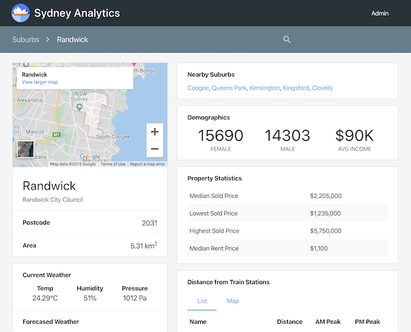

# Sydney Data Services API

A RESTful API that provides information, statistics, insights and predictions on Sydney suburbs.

## Overview

Sydney is an expansive and diverse metropolitan area of almost 700 suburbs. People moving to or within Sydney find it overwhelming when trying to find a suburb that suits their particular lifestyle or living circumstances.   

Our API and GUI provide a detailed look into the suburbs of Sydney, giving the user insightful information as to what each suburb can offer them, such as:
* Demographics
* Crime rates
* Schools
* Distance to transport
* Local food and restaurants 
* Weather predictions
* Real estate pricing and availability

## GUI



**API**
```
$ pip install pyjwt
$ python3 api.py
```

**GUI**
```
$ cd GUI
$ npm -U install
$ npm start
```

---


